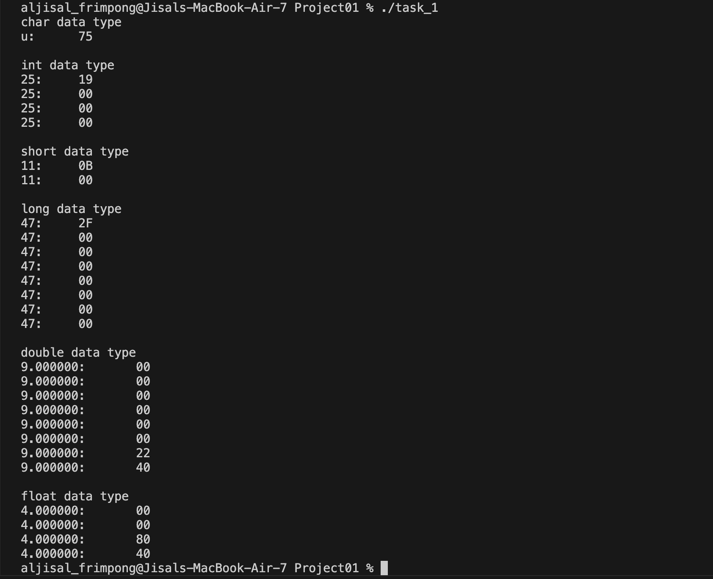
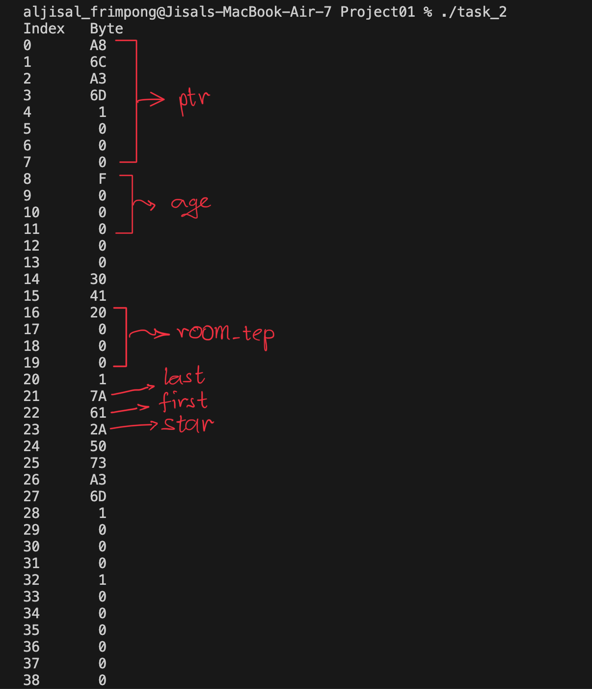
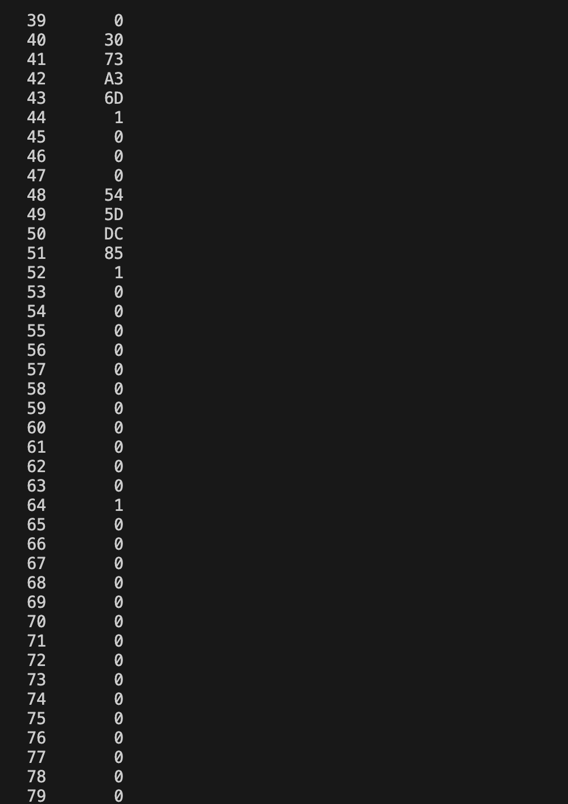
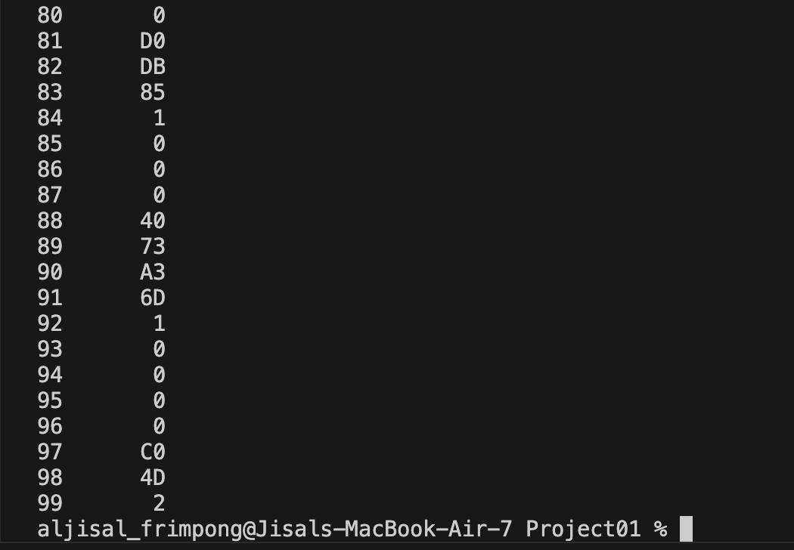
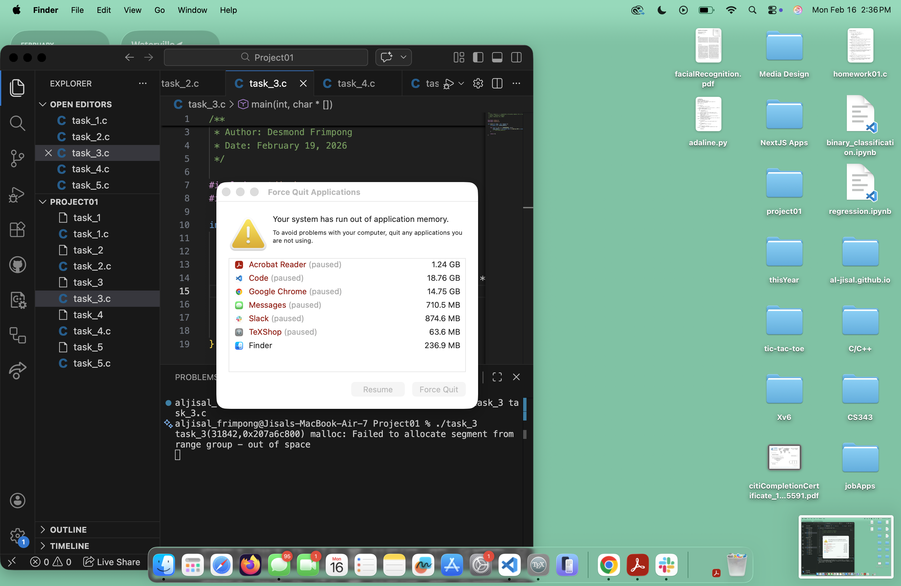
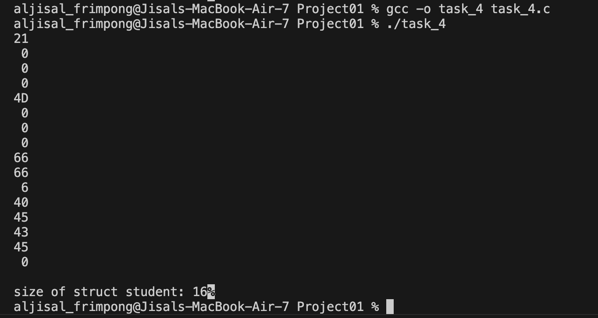
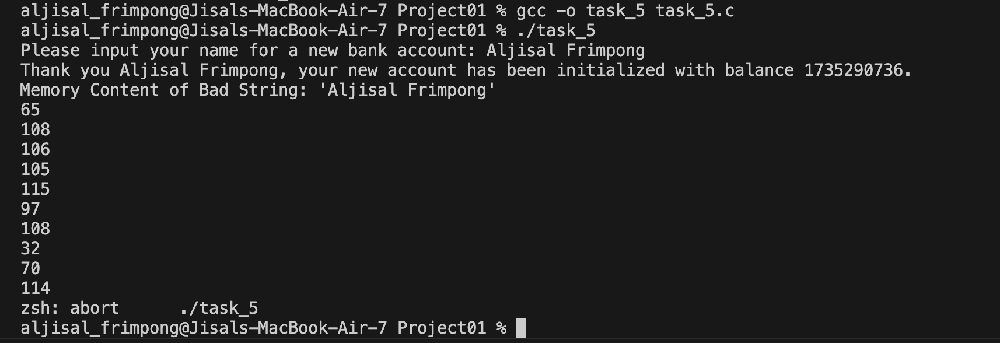
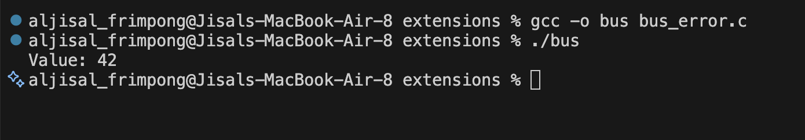
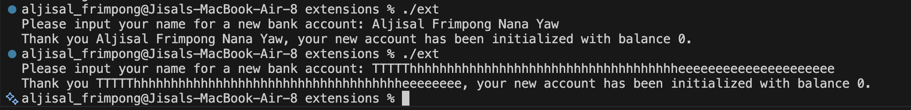

# CS333 - Project 1 - README
### Desmond Frimpong
### 02/19/2026

***Google Sites Report: https://sites.google.com/colby.edu/desmonds-cs333/home ***

## Directory Layout:
```
.
├── extensions
│   ├── bus_error.c
│   └── robust_task_5.c
├── images
│   ├── bus_error.png
│   ├── robust.png
│   ├── task_1_img.png
│   ├── task_2a_img.png
│   ├── task_2b_img.png
│   ├── task_2c_img.png
│   ├── task_3_img.png
│   ├── task_4_img.png
│   └── task_5_img.png
├── report.md
├── task_1.c
├── task_2.c
├── task_3.c
├── task_4.c
└── task_5.c
```
## OS and C compiler
    OS: macOS Tahoe 26.0 
    C compiler: Apple clang version 17.0.0 (clang-1700.3.19.1)

## Part I 
### task 1
**Compile:**

    $ gcc -o task_1 task_1.c

**Run:**

    $ ./task_1

**Output:**
    

**Q.b.** 

    My laptop is a big-endian machine

**Q.c.** 

    The most significant byte is stored at the lowest memory address as observed in the image above.
    For instance, the ASCII code for 'u', 75, is stored at the first memory address, which is the lowest.
    
### task 2
**Compile:**
    
    $ gcc -o task_2 task_2.c

**Run:**

    $ ./task_2

**Output:**




**Q.b.** 

    The variables are all stored at the top of the stack! These variables have small sizes,
    so they are all grouped together 

**Q. c.**

    Yes! There are series of non-zero values that I don't know what they represent.

**Q. d.**

    From the first image, I have marked out the variables defined in my C program and their
    location on the stack

### task 3
**Compile:**

    $ gcc -o task_3 task_3.c

**Run:**

    $ ./task_3

**Output:**


**Q.b.** 

    When free() is called on the allocated memory, the memory requirement of the program is fairly
    constant and sustainable. When free() is commented out, my machine runs out of application memory,
    and this is because the program hoards chunks of memory without ever making them available. 

### task 4
**Compile:**

    $ gcc -o task_4 task_4.c

**Run:**

    $ ./task_4

**Output:**


**Q.a.** 

    No! I was expecpting a size of 11 bytes, but it returned 16 bytes (as shown in the image above)

**Q.b.**

    The char and int types are at the top of the stack and the float and array are at the bottom of the stack.
    This kind of grouping allows the stack to grow efficiently, reducing memory segmentation.

### task 5
**Compile:**

    $ gcc -o task_5 task_5.c

**Run:**

    $ ./task_5

**Q.a.**

    "Aljisal Frimpong" is the string I found not working with the program

**Q.b.** 



**Q.c.**

    "Aljisal Frimpong" overflows the name variable in the Account struct. The name variable has a 
    maximum size of 10 characters, but "Aljisal Frimpong" is 16 characters long. This overflow fills 
    parts of the memory space for the account variable, hence the large number seen as the value of 
    account without any initialization of the account variable.


## Extensions
### extension 1
**Description**

    For an extension, I wrote a short C program that generates a bus error.
    Bus error occurs when a program tries to access memory in a way that the CPU cannot handle physically,that is in a misaligned or invalid way.

    The program allocates 8 bytes of heap memory using malloc and then intentionally creates a misaligned pointer by casting (buffer + 1) to an int *. Since an int typically requires 4-byte alignment, adding 1 byte shifts the pointer away from a properly aligned boundary. 
    
    On some ARM systems (such as certain Raspberry Pi configurations), dereferencing this misaligned pointer and writing 42 to it triggers a SIGBUS (bus error) because the CPU enforces strict alignment rules for multi-byte data types.
    
    However, when executed on my Apple Silicon Mac (M2), the program does not trigger a SIGBUS. This is because modern ARM64 processors used by macOS support unaligned memory access in hardware, and the operating system allows it. As a result, the write succeeds and the program prints Value: 42. This demonstrates that misaligned memory access behavior is architecture-dependent: what causes a hardware fault on stricter systems may execute normally on modern, alignment-tolerant CPUs like those in macOS devices.

**Compile:** 

    $ gcc -o bus_error bus_error.c

**Run:** 

    $ ./bus_error

**Output:**


### extension 2
**Description**

    For an extension, I made the program in task 5 robust! That is, it could take any lenght of 
    string as name without breaking the program. I used the fgets() function from the C standard
    library to handle the input. It takes an input string up to the size of a specified amount.
    To allow for long names, I increased the size of the name variable from 10 to 50

**Compile:** 

    $ gcc -o robust robust_task_5.c

**Run:** 

    $ ./robust

**Output:**


    It can be seen from above that "Aljisal Frimpong Nana Yaw" does not break the program!
    To push it further, a long string of 70 characters was passed to the program as name and 
    didn't break the program (there's no overflow, yayyyyy!!!)