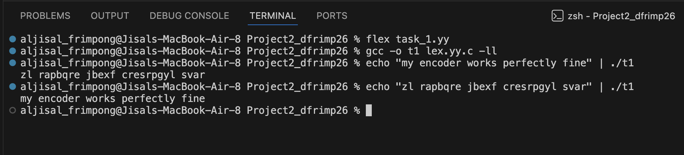
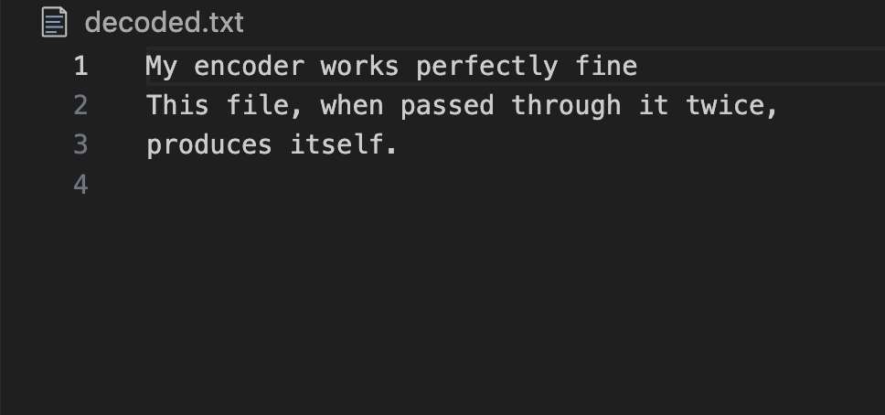
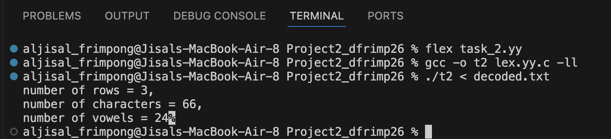
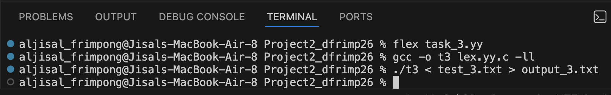
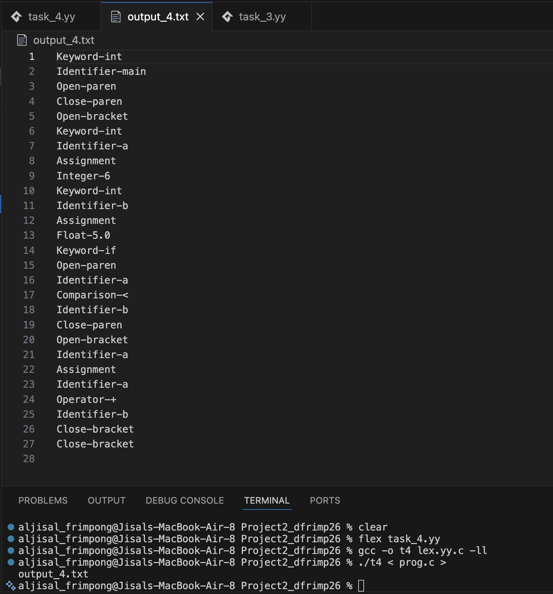
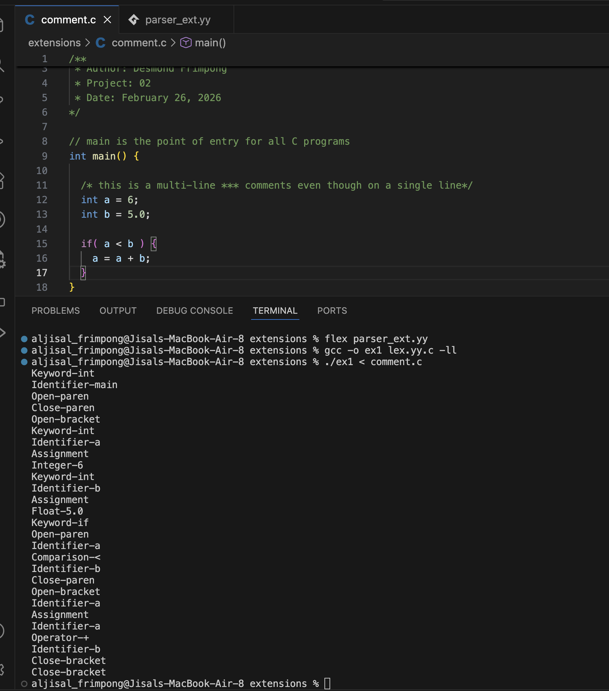
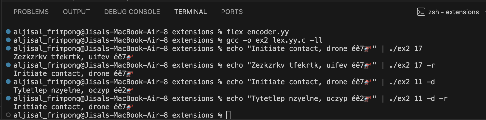

# CS333 - Project 2 - README
### Desmond Frimpong
### 02/26/2026

*** Google Sites Report: https://sites.google.com/colby.edu/desmonds-cs333/home ***

## Directory Layout:
```
.
├── decoded.txt
├── encoded.txt
├── extensions
│   ├── comment.c
│   ├── encoder.yy
│   ├── lex.yy.c
│   └── parser_ext.yy
├── images
│   ├── ex1.png
│   ├── ex2.png
│   ├── task_1.png
│   ├── task_2a.png
│   ├── task_2b.png
│   ├── task_3.png
│   └── task_4.png
├── lex.yy.c
├── output_3.txt
├── output_4.txt
├── report.md
├── t1.txt
├── task_1.yy
├── task_2.yy
├── task_3.yy
├── task_4.yy
├── test_3.txt
└── test_4.c
```
## OS and C compiler
    OS: macOS Tahoe 26.0 
    C compiler: Apple clang version 17.0.0 (clang-1700.3.19.1)

## Part I 
### task 1
**Compile:**

    $ flex task_1.yy
    $ gcc -o t1 lex.yy.c -ll

**Run:**

    $ ./t1 < input_filename > output_filename

**Output:**



    As shown in the image above, a run of my program with an output from a first run, 
    I get the same output as my original input.

**flex Code Explanation** 

    Firstly, my program matches an alphabet and finds its position in the range 0 - 25 by
    finding the absolute difference in their ASCII values. The program then shifts this 
    position by 13 and makes sure it wraps around by dividing the result by 26. Finaly,
    the program finds the corresponding letter for the code by adding ASCII code of 'a' to
    it.

### task 2
**Compile:**
    
    $ flex task_2.yy
    $ gcc -o t2 lex.yy.c -ll

**Run:**

    $ ./t2 < input_filename

**Output:**



    As shown above, the program correctly outputs 3 rows, 66 characters, and 24 vowels.
    I know that the character and vowel counts are correct because I did count. You can
    give it a shot too if you may!

**flex Code Explanation** 

    First, my program defines variables to store the counts for rows, characters, and vowels.
    It increases the row count whenever it matches a '\n', the vowel count when it matches 
    either lower or upper case vowels, and the character count as it matches any character.

### task 3
**Compile:**

    $ flex task_3.yy
    $ gcc -o t3 lex.yy.c -ll

**Run:**

    $ ./t3 < test_3.txt > output_3.txt

**Output:**


    Check the the program's output in output_3.txt in this folder

**flex Code Explanation** 

    Firstly, my program defines what letter, digit, and boundary of a word are.
    The boundary defination matches when the string starts a new line or there's
    no alphanumeric character before or after the string. With that, words are 
    easily matched and replaced by the desired replacements. For instance, even 
    though "Catch" has "Cat" in it, it is not turned into "lionch". This is because
    the boundary condition fails as 't' is followed by 'c', an alphanumeric character. 

### task 4
**Compile:**

    $ flex task_4.yy
    $ gcc -o t4 lex.yy.c -ll

**Run:**

    $ ./t4 < prog.c > output_4.txt

**Output:**


**flex Code Explanation** 

        My program defines INTEGER, FLOAT, KEYWORD, IDENTIFIER, COMPARISON, AND OPERATOR
    which makes the rules definitions very concise! The program matches these definitions
    and other patterns like '{' and prints to the terminal the corresponding string like
    "Open-bracket". My program matches comments, white space, and newline characters and
    ignores them.
        For an identifier token, the definition requires that it starts with either an
    underscore( _ ) or an alphabet and is followed by zero or more underscore or alphanumeric
    characters 

## Extensions
### extension 1
**Description**

    For an extension, I made my parser for Clite robustly handle comments. Single-line and multi-line comments in C do not produce tokens during parsing. 
    
    For single-line comments, my program matched "//" and everything on that line using "//".* pattern. This pattern means that match "//" and anything that comes after it (anything can be nothing!).

    For the multi-line comments, I used this pattern, "/*"([^*]|\*+[^*/])*\*+"/", to match them. First, the pattern matches "/*", the start of a multi-line C comments. The pattern then matches zero or more of anything which is either * or not using ([^*]|\*+[^*/])* pattern. It then hunts for the closing tag "*/" using \*+"/" pattern.

    As shown in the output below, I tested this on variety of examples of comments in the comment.c file

**Compile:** 

    $ flex parser_ext.yy
    $ gcc -o ex1 lex.yy.c -ll

**Run:** 

    $ ./ex1 < comment.c

**Output:**


### extension 2
**Description**

    For an extension, I decided to make the encoder(ROT13) from task 1 more robust!
    I extended it to a fully configurable UTF-8 ROT-N cipher with optional digit rotation and reverse mode. Users can specify the shift amount, choose to rotate digits, -d, modulo 10, and enable -r for automatic decryption. The program preserves all non-ASCII characters, ensuring UTF-8 sequences such as accented letters, Greek, Japanese, and emoji are not corrupted. This implementation demonstrates advanced handling of multibyte character encoding, modular arithmetic, and flexible command-line options, making it a robust and fully reversible text transformation tool.

**Compile:** 

    $ flex encoder.yy
    $ gcc -o ex2 lex.yy.c -ll

**Run:** 

    $ echo "string to be encoded" | ./ex2 [N] [-d] [-r] 

**Output:**


    As seen above, the amount of rotation of non-digit characters can be controlled by the user. Users can decrypte a coded message by the -r flag. They can also encrypt digits as well by passing -d flag
    