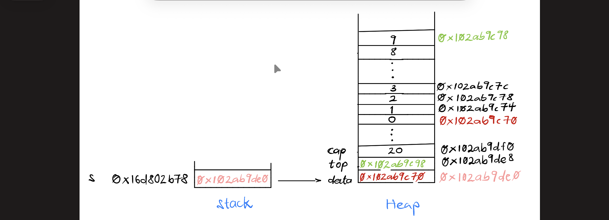

# CS333 - Project 3 - README
### Desmond Frimpong
### 03/12/2026

*** Google Sites Report: https://sites.google.com/colby.edu/desmonds-cs333/home ***

## Directory Layout:
```
├── cstk.c
├── cstk.h
├── cstktest
├── cstktest.c
├── images
│   ├── mark_1.png
│   ├── mark_2.png
│   ├── task_3.png
│   └── task_4.mov
├── report.md
├── task1.ts
├── task2.ts
├── task3.ts
├── td
└── toDraw.c
```
## OS and C compiler
    OS: macOS Tahoe 26.0 
    C compiler: Apple clang version 17.0.0 (clang-1700.3.19.1)

## Part I 
### task 3
**Compile:**

    $ gcc -o cstktest cstktest.c cstk.c

**Run:**

    $ ./cstktest

**Output:**


    As shown in the image above, my stack program passes all test cases 


### task 4
**Compile:**
    
    $ gcc -o cstktest cstktest.c cstk.c

**Run:**

    $ ./cstktest

**Output:**

    I have included a video, task_4.mov, of my Activity Monitor as requested in my folder


### task 5
**Compile:**

    gcc -o td toDraw.c cstk.c

**Run:**

    $ ./td 

**Output:**


    At "Mark 1," the memory (stack and heap) looks like the image above. The pointer variable, s, is on the stack and points to s->data on the heap. s->data, s->top, and s->capacity are stored consecutively on the heap. s->data and s->top point to the boundaries of the content of the stack data structure on the heap.


    At "Mark 2," the memory (stack and heap) looks like the image above. The heap memory previously occupied by the the stack data structure is freed, which is depicted by drawing nothing. The pointer variable s is still on the stack even though it cannot be access.


## Extensions

    No Extension