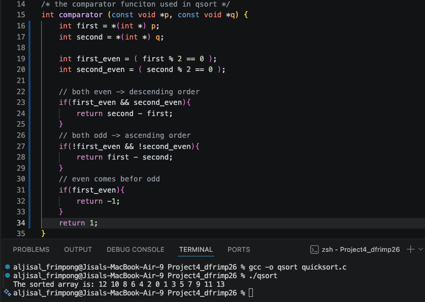
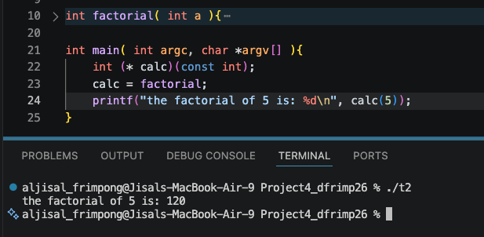
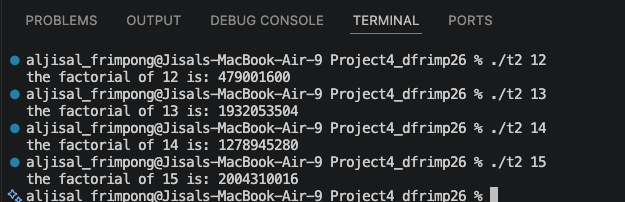
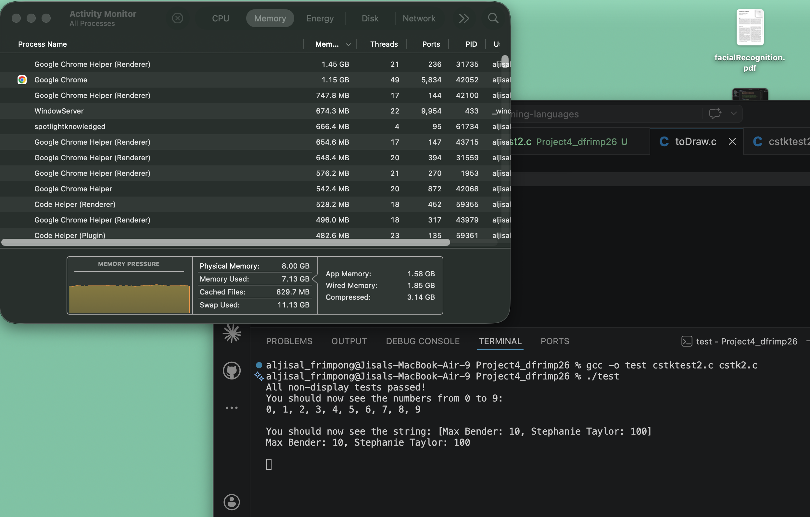
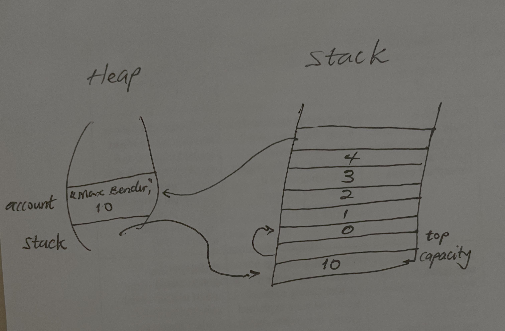

# CS333 - Project 4 - README
### Desmond Frimpong
### 03/20/2026

*** Google Sites Report: https://sites.google.com/colby.edu/desmonds-cs333/home/project-4-semantics-of-ts ***

## Directory Layout:
```
├── cstk2.c
├── cstk2.h
├── cstktest2.c
├── images
│   ├── task_1.png
│   ├── task_2a.png
│   ├── task_2b.png
│   └── task_3.png
├── quicksort.c
├── report.md
├── task2.c
├── task4.js
├── task5.js
└── toDraw2.c
```
## OS and C compiler
    OS: macOS Tahoe 26.0 
    C compiler: Apple clang version 17.0.0 (clang-1700.3.19.1)

## Part I 
### task 1
**Compile:**

    $ gcc -o qsort quicksort.c

**Run:**

    $ ./qsort

**Output:**



    To implement the comparator, the function returns negative when the first parameter comes before the second and positive otherwise. I check whether the inputs are negative or positive, and then follow the requirements given in the project( it's basically an if...else statements for the implementation) 


### task 2a
**Compile:**
    
    $ gcc -o task2 task2.c

**Run:**

    $ ./task2

**Output:**



    This demonstrates that functions in C can be treated similarly to data through
    the use of function pointers. The variable calc stores the address of the
    factorial function and can later be used to invoke the function indirectly.
    This highlights that functions have types and addresses in memory just like
    variables.


### task 2b
**Compile:**
    
    $ gcc -o task2 task2.c

**Run:**

    $ ./task2

**Output:**



    The factorial values increase extremely quickly as N increases. While 12!
    still fits within a standard 32-bit integer, larger factorials such as 13!,
    14!, and 15! exceed the maximum value that can be represented by a signed int.
    This causes integer overflow, leading to incorrect results.


### task 3
**Compile:**

    gcc -o stack2 cstktest2.c cstk2.c

**Run:**

    $ ./stack2

**Output:**


## a

    My implementation starts with an initial dynamically allocated buffer and doubles its capacity whenever additional space is needed. This ensures linear runtime complexity while also avoiding excessive memory allocation.

## b

    I also implemented helper functions such as intToString and accountToString, which cast void pointers to their proper data types before converting them into string representations.

## c

    The stk_toString method dynamically allocates memory for the resulting string and resizes the buffer using realloc when necessary. Temporary strings returned by helper conversion functions are freed immediately after concatenation, preventing memory leaks. The implementation therefore maintains efficient memory usage while safely supporting dynamically sized stack contents.

## memory stack



## Extensions

    No Extension