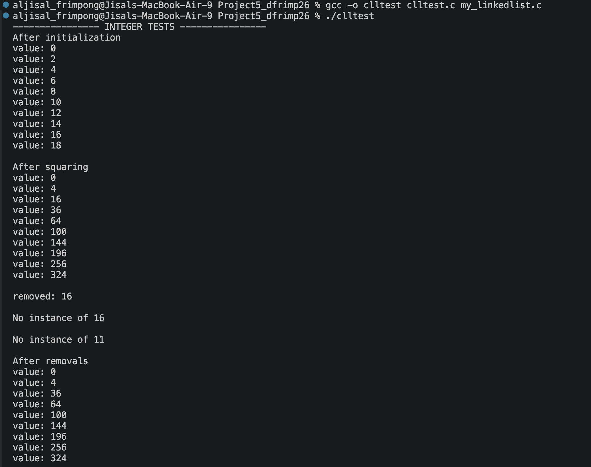
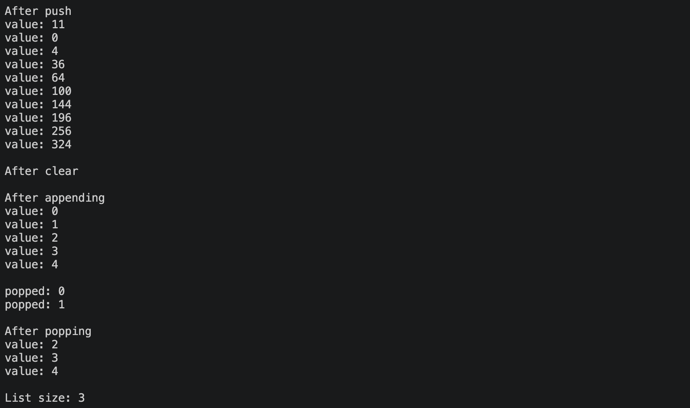
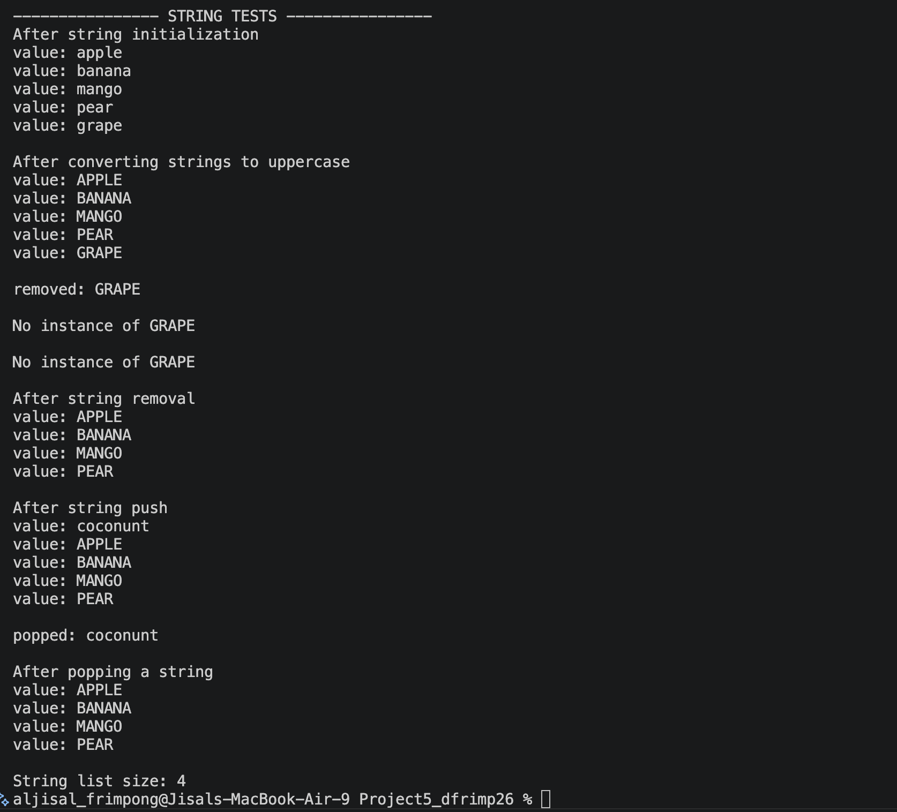
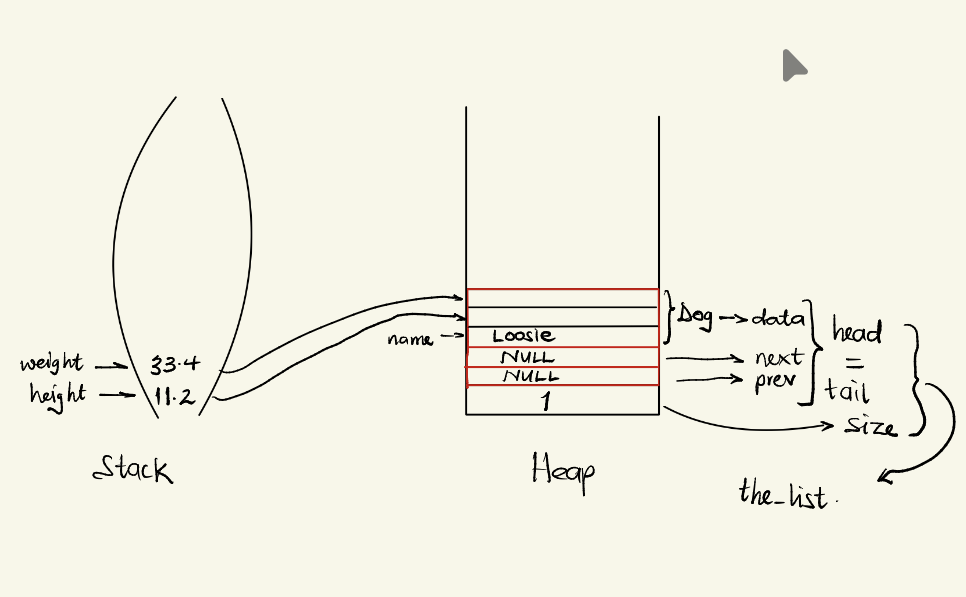

# CS333 - Project 5 - README
### Desmond Frimpong
### 04/09/2026

*** Google Sites Report: https://sites.google.com/colby.edu/desmonds-cs333/home ***

## Directory Layout:
```
├── clltest.c
├── my_linkedlist.c
├── my_linkedlist.h
└── report.md
```
## OS and C compiler
    OS: macOS Tahoe 26.0 
    C compiler: Apple clang version 17.0.0 (clang-1700.3.19.1)

## Part I 
### task 1 d
**Compile:**

    $ gcc -o clltest clltest.c my_linkedlist.c

**Run:**

    $ ./clltest

**Output:**




    As shown in the image above, my linkedlist program passes all test cases! Also, I tested it on a string data type, and it worked perfectly.


### task 1 e
**Compile:**
    
    $ gcc -o clltest clltest.c my_linkedlist.c

**Run:**

    $ ./clltest

**Output:**




### task 1 f
**Compile:**

    $ gcc -o clltest clltest.c my_linkedlist.c

**Run:**

    $ ./clltest

**Output:**


    At "Mark 1," the memory (stack and heap) looks like the image above. 

## Extensions

    No Extension