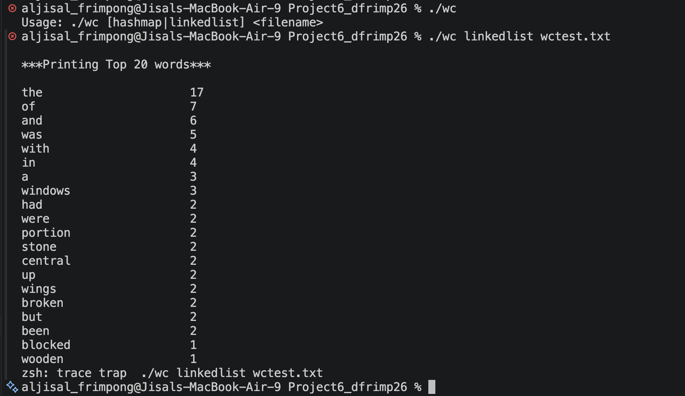
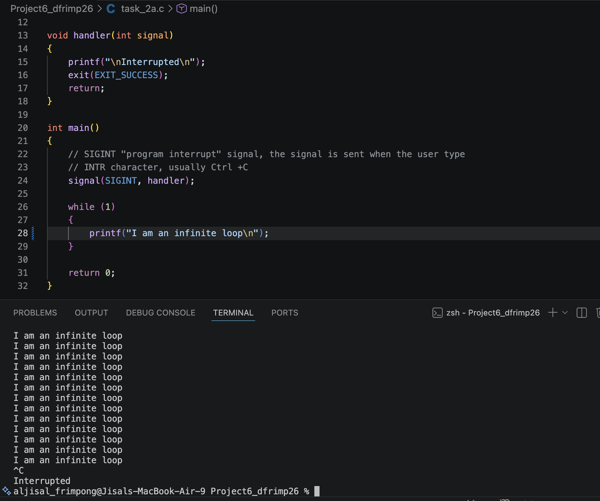
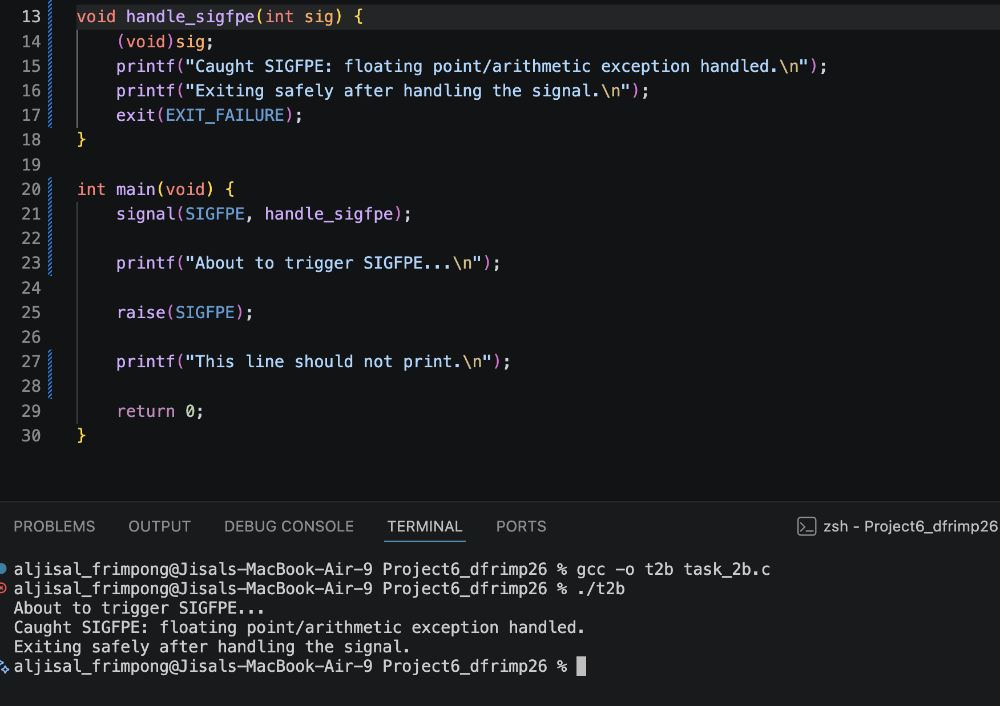
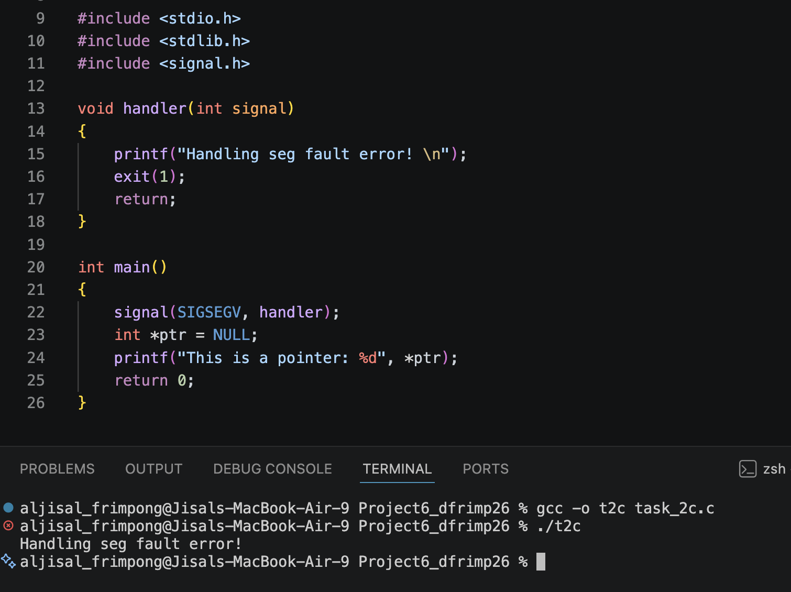
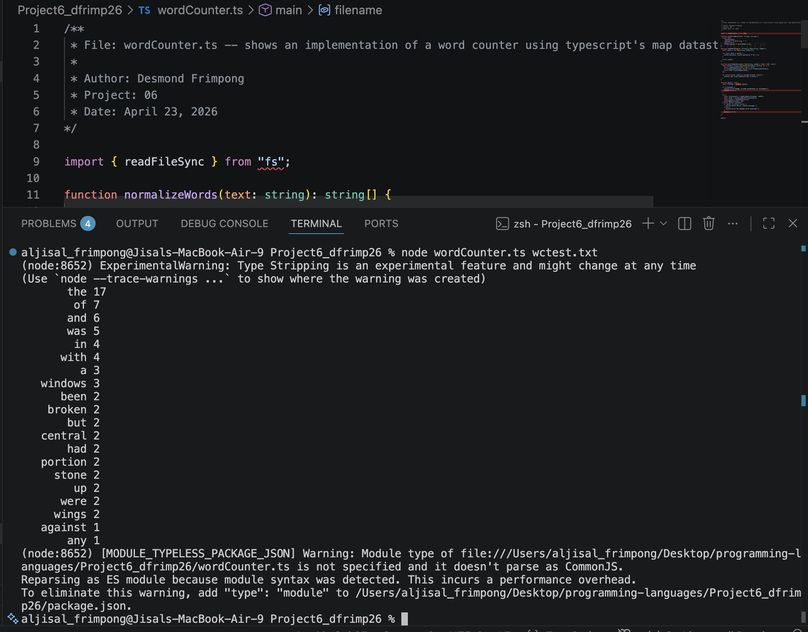

# CS333 - Project 6 - README
### Desmond Frimpong
### 04/23/2026

*** Google Sites Report: https://sites.google.com/colby.edu/desmonds-cs333/home ***

## Directory Layout:
```

```
## OS and C compiler
    OS: macOS Tahoe 26.0 
    C compiler: Apple clang version 17.0.0 (clang-1700.3.19.1)

## Part I 
### task 1
**Compile:**

    $ gcc -o wc my_linkedlist.c wordCounter.c

**Run:**

    $ ./wc wctest.txt

**Output:**



### How I implemented the requirements
a. Each alphabetic character is converted to lowercase using `tolower()` before the word is stored.

b. The program reads the file character by character with `fgetc()`. Only alphabetic characters are added to the current word.

c. The program checks `argc` and reads the filename from `argv[1]

d. The program copies the linked-list word counts into an array, sorts the array using `qsort()`, and prints the first 20 entries. 


### task 2a
**Compile:**
    
    $ gcc -o t2a task_2a.c

**Run:**

    $ ./t2a

**Output:**




### task 2b
**Compile:**
    
    $ gcc -o t2b task_2b.c

**Run:**

    $ ./t2b

**Output:**




### task 2c
**Compile:**
    
    $ gcc -o t2c task_2c.c

**Run:**

    $ ./t2c

**Output:**




## Part II
### task 1

**Run:**

    $ node wordCounter.ts wctest.txt

**Output:**



    The above screenshot shows the output for my word counter in Typescript


## Extensions

    No Extension