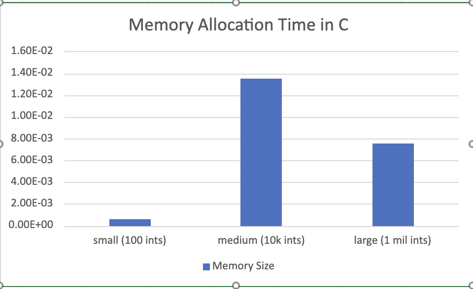
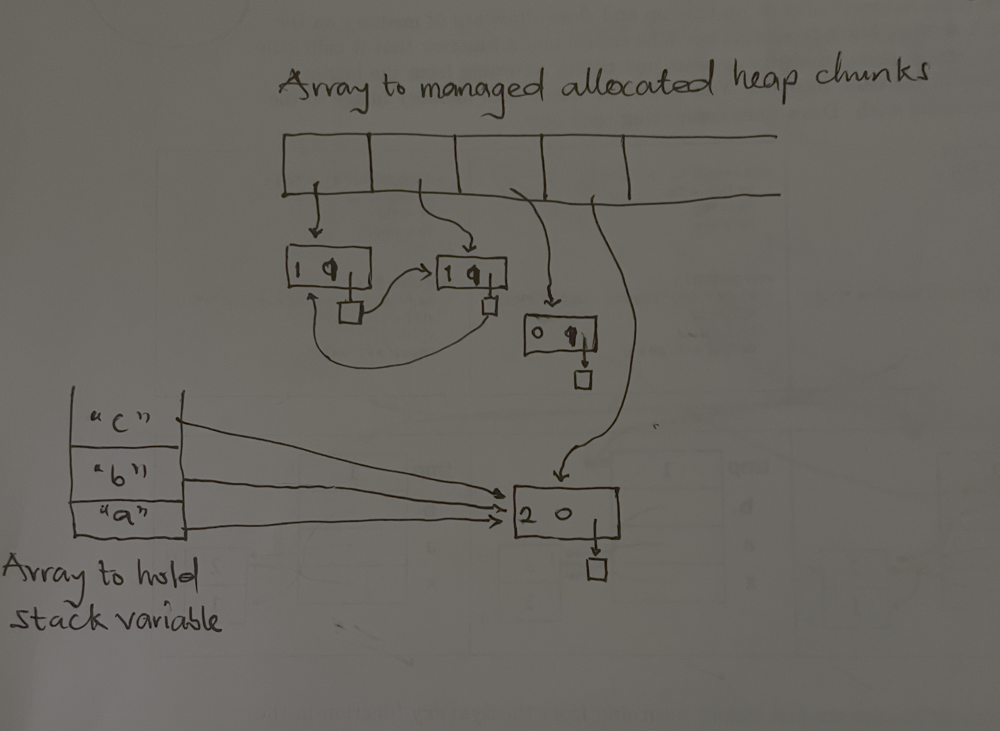

# CS333 - Project 7 - README
### Desmond Frimpong
### 04/30/2026

*** Google Sites Report: https://sites.google.com/colby.edu/desmonds-cs333/home ***

## Directory Layout:
```
├── images
│   ├── task_1.png
│   └── task_2.png
├── report.md
├── task_1.c
└── task_2.c
```
## OS and C compiler
    OS: macOS Tahoe 26.0 
    C compiler: Apple clang version 17.0.0 (clang-1700.3.19.1)

## Part I 
### task 1
**Compile:**

    $ gcc -o t1 task_1.c

**Run:**

    $ ./t1

**Output:**



    The image above shows that allocation time generally increases as the amount of memory being
    allocated becomes larger. Small memory allocations required the least amount of time, while medium and large allocations took noticeably longer. This demonstrates that allocating more memory requires more work from the system because the operating system and runtime environment must reserve larger sections of memory. 

    Although the large allocation appears slightly faster than the medium allocation in this experiment (this can happen because of factors such as operating system memory optimization, caching, and runtime overhead), in general, larger allocations are expected to take longer.

    Also, allocating memory all at once is usually more efficient than allocating many small chunks repeatedly. When memory is allocated in many smaller pieces, the program must repeatedly request memory from the runtime system, which increases overhead and may contribute to memory fragmentation. Allocating a larger block at once reduces the number of allocation operations and can improve overall performance.


### task 2
**Compile:**
    
    $ gcc -o t2 task_2.c

**Run:**

    $ ./t2

**Output:**



Initially, heap memory is allocated for `aChunk` and `bChunk`. References are then added so that `aChunk` points to `bChunk`, and `bChunk` points back to `aChunk`. This creates a cyclic reference structure in the heap. Next, another heap allocation is created for `cChunk`, which is assigned to the stack variable `c`. Afterward, `bChunk` is reassigned to a completely new heap allocation. The stack variables `a`, `b`, and `c` are all updated to point to this new allocation. At this point, the original `aChunk` and `bChunk` objects are no longer reachable from the stack. However, the original heapChunks still reference each other through the cycle. Reference counting would fail to reclaim them because each object still has an incoming reference, but mark-and-sweep would correctly identify the cycle as unreachable and free the memory.


## Extensions

    No Extension