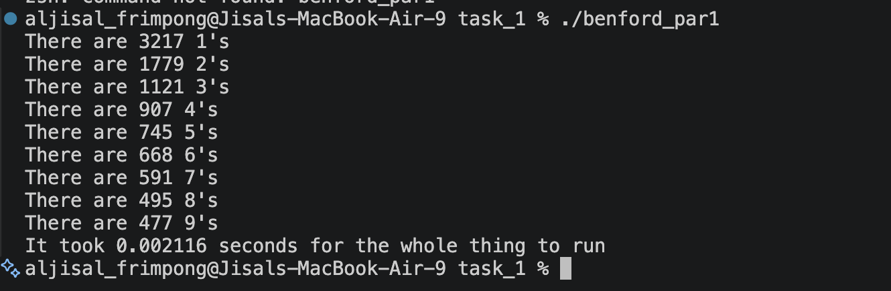
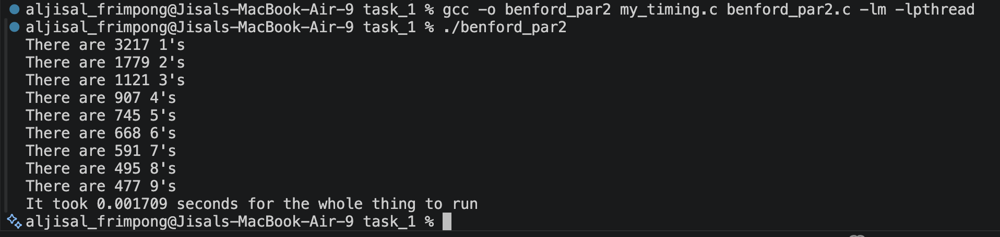
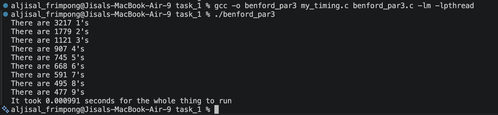
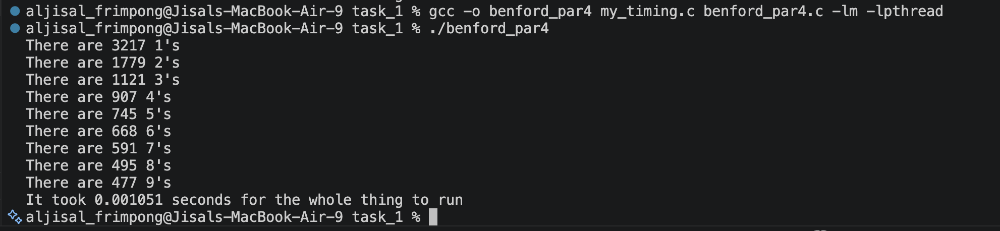
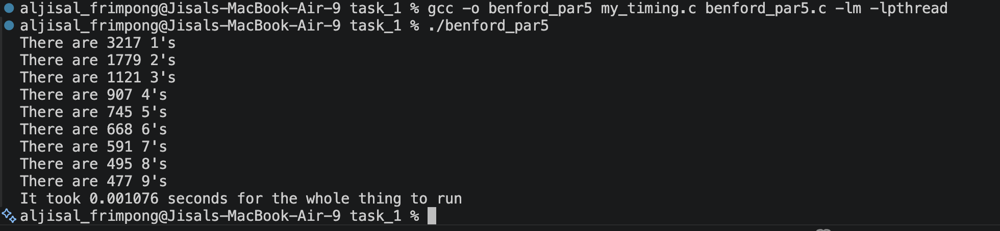
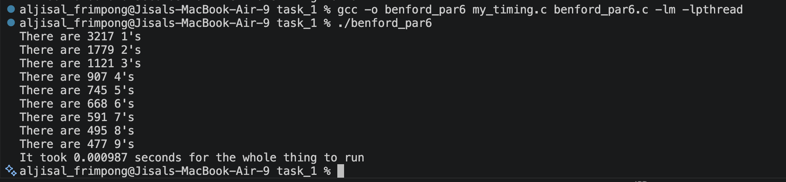
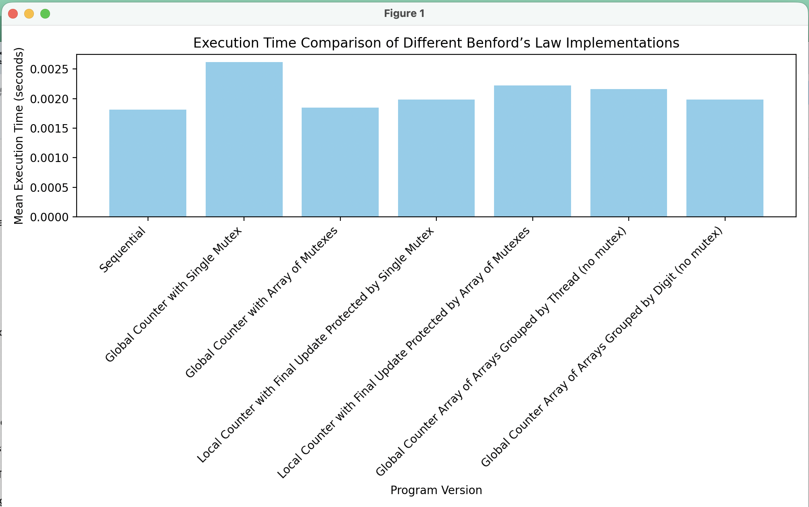
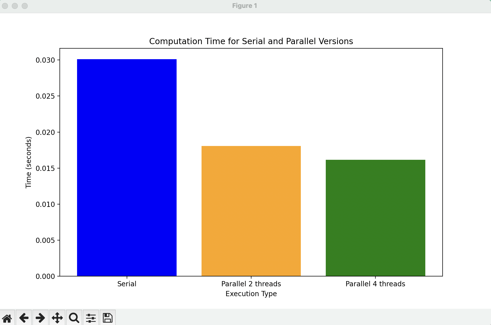
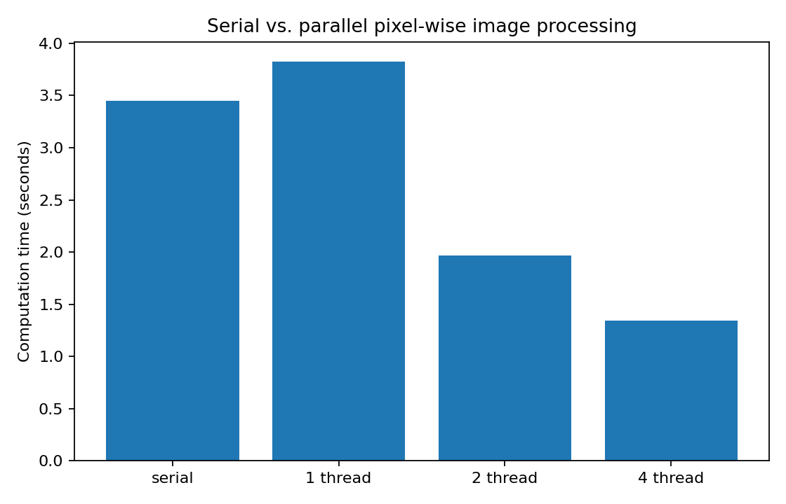

# CS333 - Project 8 - README
### Desmond Frimpong
### 05/08/2026

*** Google Sites Report: https://sites.google.com/colby.edu/desmonds-cs333/home ***

## Directory Layout:
```
├── benford_sequential.c
├── longer.bin
├── longer_nonBenford.bin
├── medium.bin
├── my_timing.c
├── my_timing.h
├── report.md
├── super_short.bin
├── task_1
│   ├── benford_par1.c
│   ├── benford_par2.c
│   ├── benford_par3.c
│   ├── benford_par4.c
│   ├── benford_par5.c
│   ├── benford_par6.c
│   ├── benford_sequential.c
│   ├── longer.bin
│   ├── longer_nonBenford.bin
│   ├── medium.bin
│   ├── my_timing.c
│   ├── my_timing.h
│   ├── super_short.bin
│   └── task1.py
└── task_2
    ├── kit
    │   ├── IMG_4203.ppm
    │   ├── colorize.c
    │   ├── ppmIO.c
    │   └── ppmIO.h
    └── task2.py
```
## OS and C compiler
    OS: macOS Tahoe 26.0 
    C compiler: Apple clang version 17.0.0 (clang-1700.3.19.1)

## Part I 
### task 1
### i
**Compile:**

    $ gcc -o benford_par1 my_timing.c benford_par1.c -lm -lpthread

**Run:**

    $ ./benford_par1

**Output:**




### ii
**Compile:**

    $ gcc -o benford_par2 my_timing.c benford_par2.c -lm -lpthread

**Run:**

    $ ./benford_par2

**Output:**




### iii
**Compile:**

    $ gcc -o benford_par3 my_timing.c benford_par3.c -lm -lpthread

**Run:**

    $ ./benford_par3

**Output:**




### iv
**Compile:**

    $ gcc -o benford_par4 my_timing.c benford_par4.c -lm -lpthread

**Run:**

    $ ./benford_par4

**Output:**




### v
**Compile:**

    $ gcc -o benford_par5 my_timing.c benford_par5.c -lm -lpthread

**Run:**

    $ ./benford_par5

**Output:**




### vi
**Compile:**

    $ gcc -o benford_par6 my_timing.c benford_par6.c -lm -lpthread

**Run:**

    $ ./benford_par6

**Output:**



### Conclusions



The versions that lock a mutex for every number are slower because they create a large amount of synchronization overhead. The single-mutex global counter version is usually the slowest parallel version because all threads must wait for the same lock before updating the shared counter.

Using an array of mutexes improves performance because different digits can be updated independently. However, it still requires locking and unlocking for every number, so the overhead is still significant.

The local counter versions perform better because each thread counts digits independently in a private local array. The mutex is only used at the end when the thread adds its local results to the global counter. This greatly reduces the number of lock operations.

The no-mutex versions are usually among the fastest because each thread writes to its own section of the global array. Since no two threads write to the same location, there is no race condition and no need for mutex protection.

### Role of Mutex Locks

Mutex locks are used to prevent race conditions when multiple threads access and modify shared data. In this project, race conditions can happen when multiple threads try to update the same digit counter at the same time.

However, mutexes also add overhead. If a program locks and unlocks too often, the synchronization cost can reduce or even eliminate the benefit of parallelism. Therefore, mutexes should be used only when shared data really needs protection.

### When Should Mutexes Be Used?

A mutex should be used when multiple threads may read and write the same shared variable at the same time, and at least one of those operations is a write.

For this problem, mutexes are needed when all threads update the same global counter array. However, mutexes are not needed when each thread writes to a separate private counter or to a separate section of a global array.

In general, the best strategy is to avoid shared writes when possible. If shared writes are unavoidable, mutexes should be used carefully and the amount of locked code should be kept as small as possible.


### task 2
**Compile:**

    $ gcc -o colorize -I. colorize.c ppmIO.c -lm

**Run:**

    $ ./colorize 

**Output:**


    The graph above shows a clear reduction in computation time as the number of threads increases.

## Performance Analysis

The results show that parallel processing improves performance compared to the serial version.

- The 2-thread version significantly reduces execution time.
- The 4-thread version provides additional improvement.
- Performance gains become smaller as more threads are added.

This happens because:

- Thread creation introduces overhead.
- The workload may not be large enough to fully utilize all CPU cores.
- Memory access and synchronization costs can limit scalability.

Despite these limitations, the parallel implementation clearly demonstrates the benefits of dividing computational work across multiple threads.


## Part I 
### task 2

Run the image processor normally with 4 workers:

```bash
python3 parallel_image.py IMG_4203.ppm --out output.ppm --threads 4 --iterations 20
```

Run the benchmark:

```bash
python3 parallel_image.py IMG_4203.ppm --benchmark --iterations 20
```

The benchmark creates:

```text
benchmark_results.csv
benchmark_graph.png
```



### Analysis

The serial version processes the full image in one process. The parallel versions divide the image into chunks and process those chunks at the same time.

The 1-worker parallel version is usually slower than the serial version because it still pays the overhead of creating a worker process and copying data between processes, but it does not gain true parallel speedup.

The 2-worker and 4-worker versions can reduce computation time because multiple chunks of the image are processed at the same time. However, the speedup is usually not perfectly proportional to the number of workers. This is because multiprocessing has overhead, including process creation, chunk distribution, and combining the processed chunks back into one image.

The 4-worker version should normally be the fastest for a sufficiently large image and enough repeated iterations, but the exact result depends on the computer, image size, and current system load.

## Extensions

    No Extension